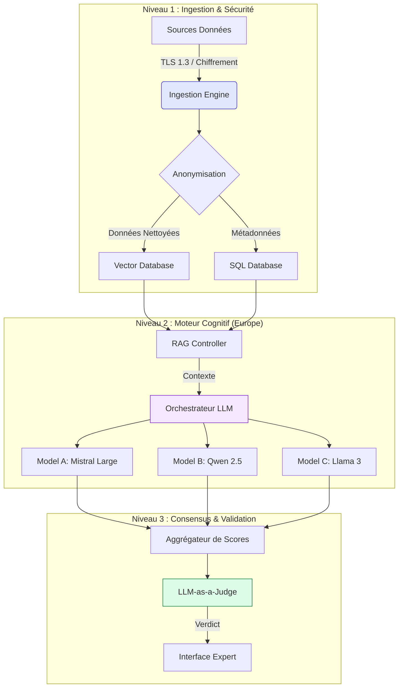
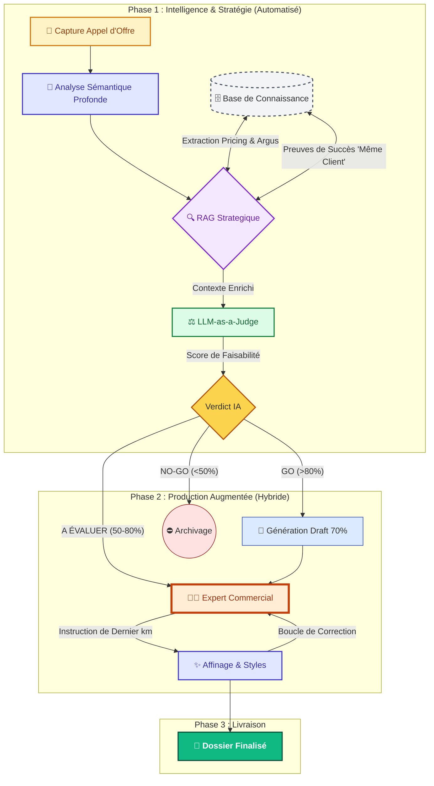

# Spécifications Techniques BidBooster

> **Statut** : Production Ready  
> **Version** : 1.2.0  
> **Dernière MÀJ** : Février 2026  
> **Classification** : Confidentiel / Interne

---

## 1. Vue d'Ensemble de l'Architecture

BidBooster repose sur une architecture **"Sovereign-First"** conçue pour garantir la confidentialité totale des données sensibles des appels d'offres. Le système utilise un pipeline d'inférence RAG (Retrieval-Augmented Generation) hébergé exclusivement sur des infrastructures européennes.

### Diagramme de Flux Cognitif



---

## 2. Infrastructure & Souveraineté

Nous appliquons une politique de **Zéro Data Transfer** hors de l'Union Européenne.

| Composant | Technologie | Hébergeur | Localisation |
| :--- | :--- | :--- | :--- |
| **Compute / GPU** | Nvidia H100 Cluster | Scaleway | Paris (DC5) |
| **Vector DB** | Qdrant | OVHcloud | Roubaix |
| **App Server** | Node.js / Bun | Clever Cloud | Paris |
| **Stockage Fichier** | S3 Compatible | Scaleway | Amsterdam |

> [!IMPORTANT]
> **Conformité RGPD** : Toutes les données sont chiffrées au repos (AES-256) et en transit (TLS 1.3). Aucune donnée d'entraînement n'est renvoyée aux fournisseurs de modèles (Azure/OpenAI exclus).

---

## 3. Moteur d'Intelligence Artificielle

### Approche Multi-Modèles (Ensemble Learning)
Pour éviter les hallucinations et garantir la précision des analyses d'appels d'offres, BidBooster n'utilise pas un, mais **3 modèles concurrents** pour chaque tâche critique.

1.  **Mistral Large 2 (70B)** : Spécialiste de la syntaxe et du raisonnement juridique français.
2.  **Qwen 2.5 (72B)** : Excellent pour l'extraction de données structurées et de tableaux financiers.
3.  **Llama 3.3 (70B)** : Utilisé pour la synthèse et la reformulation commerciale.

### Algorithme de "Consensus Cognitif"
Le module **LLM-as-a-Judge** évalue la cohérence des trois sorties :
-   Si la variance est > 15%, une alerte "Incertitude" est levée pour l'expert humain.
-   Si la variance est < 5%, la réponse est considérée comme fiable et pré-validée.

---

## 4. Sécurité & Authentification

### Mécanismes de Défense
-   **WAF (Web Application Firewall)** : Protection contre les injections SQL et XSS.
-   **Rate Limiting** : 100 req/min par IP via Redis.
-   **Audit Logs** : Traçabilité immuable de toutes les décisions (Qui a validé Quoi et Quand).

### SSO & Gestion des Identités
L'intégration Enterprise supporte :
-   OIDC (OpenID Connect)
-   SAML 2.0 (Azure AD, Okta)
-   Visualisation des rôles via RBAC (Role-Based Access Control) :
    -   `Admin` : Configuration système & Facturation
    -   `Bid Manager` : Validation & Envoi
    -   `Analyst` : Enrichissement & Recherche

---

## 5. Workflow Métier : Le Pipeline "BidBooster"

Ce diagramme illustre l'interaction continue entre l'IA générative et l'expertise commerciale pour maximiser le taux de transformation ("Win Rate").



> **Note sur le RAG Stratégique** : L'IA ne cherche pas seulement des mots-clés, elle identifie des *patterns de succès*. Si nous avons déjà gagné chez ce client, les arguments utilisés lors de la victoire précédente sont "sur-pondérés" dans la génération du draft.

---

## 6. Intégrations API

Le système expose une API RESTful documentée (Swagger/OpenAPI 3.0) pour l'intégration avec les CRM du marché.

```json
// Exemple de Payload d'Analyse
{
  "tender_id": "AO-2026-X89",
  "files": ["cctp.pdf", "rc.pdf"],
  "options": {
    "deep_scan": true,
    "financial_extraction": true,
    "risk_level": "strict"
  }
}
```

---

> _Ce document est la propriété exclusive de BidBooster. Toute reproduction interdite._
